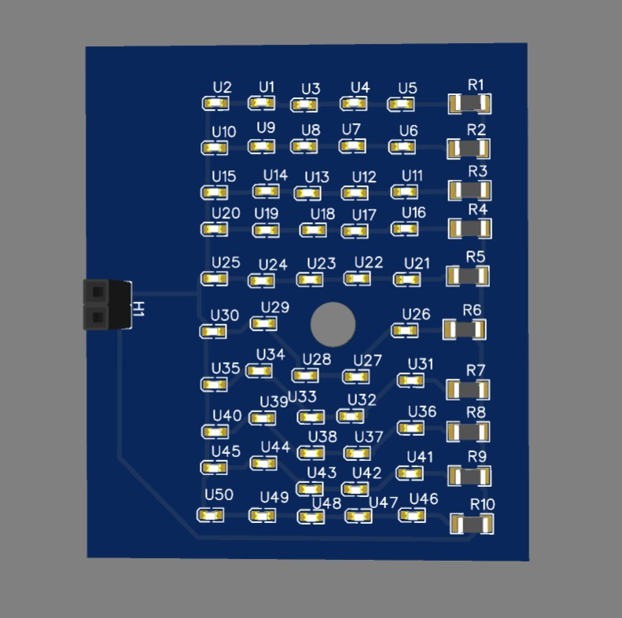

# Real-Time Image Processing using Raspberry Pi + NoIR Camera + Custom LED PCB

This project presents a complete real-time image acquisition and processing pipeline using a **Raspberry Pi**, **Raspberry Pi NoIR Camera**, and a **custom-designed LED array PCB** for controlled lighting. It uses advanced image processing techniques like **CLAHE**, **adaptive thresholding**, **Otsu’s method**, **morphological operations**, and **contour detection** to highlight areas of interest in grayscale images.

Originally based on an ESP32-CAM project, this upgraded system offers more flexibility, accuracy, and image quality.

---

## 🧰 Tools & Technologies

- **Raspberry Pi 4B**
- **Raspberry Pi NoIR Camera**
- **Custom LED Array PCB**
- **Python 3**
- **OpenCV**
- **NumPy**
- **PiCamera Python Module**

---

## 🖼️ Hardware Setup

| Raspberry Pi + NoIR Camera | Custom LED PCB |
|----------------------------|----------------|
|  |  |

---

## 🔬 Image Processing Pipeline

1. **CLAHE (Contrast Limited Adaptive Histogram Equalization)**  
2. **Median & Gaussian Blur for noise suppression**
3. **Adaptive Thresholding (Mean)**
4. **Otsu’s Thresholding**
5. **Morphological Opening**
6. **Contour Detection and Overlay**

---

